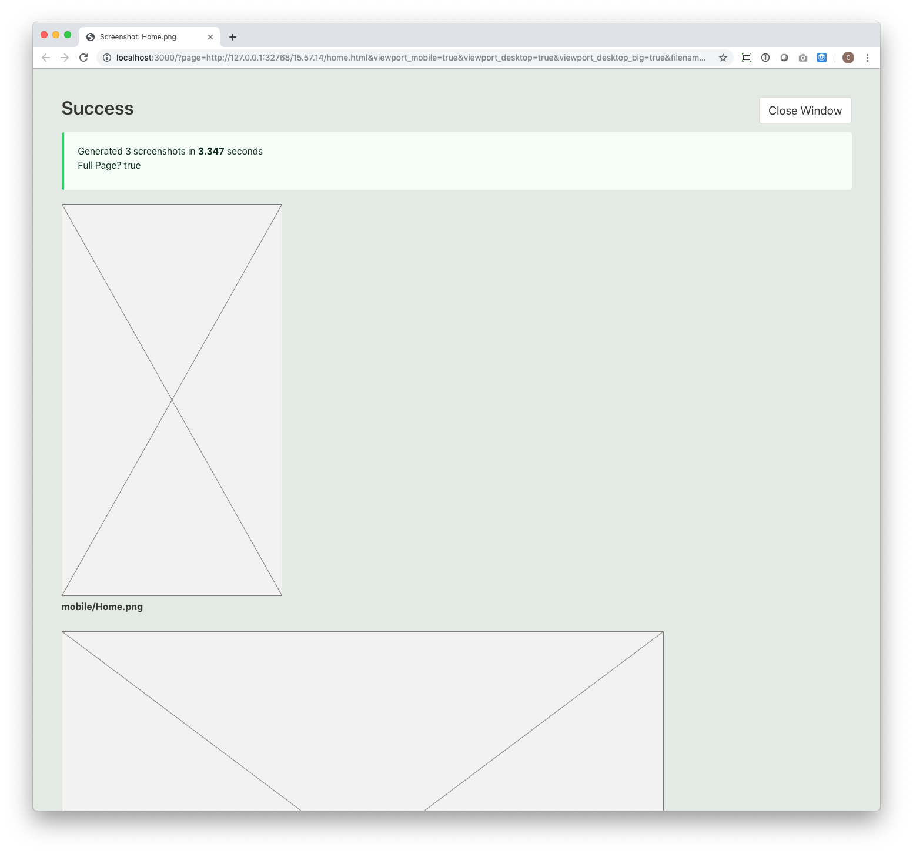
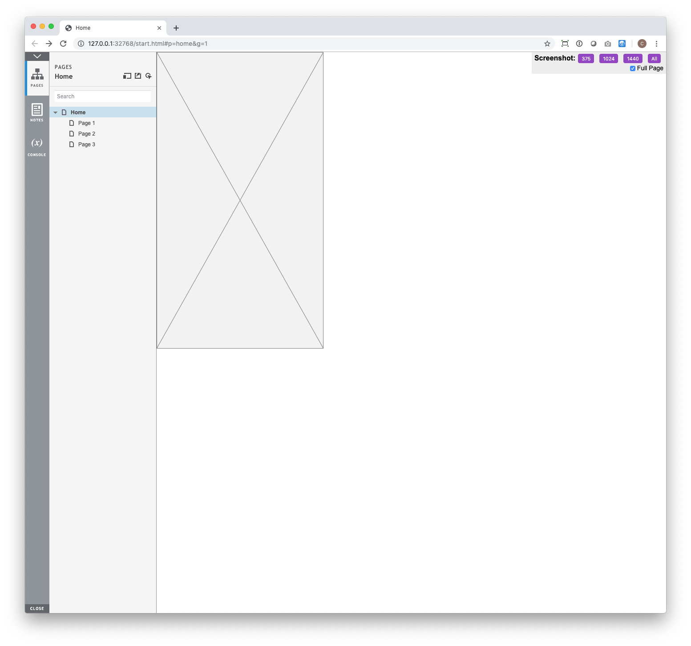

# Axure Screenshoot

Take quick single or multiple adaptive view screenshots with headless Chromium.

## Getting Started

This folder contains both a chrome extension and node/express project. 
The chrome extension will add an overlay in the top right corner of Axshare Previews and link you to the node services pages to create the screenshot(s).

### Prerequisites

You'll need Node.js and Node Package Manager (NPM) installed to run this service. NPM will install all the needed dependencies, including Chromium.

This was built with node v10.16.0 and NPM v6.9.0.

This will require using Terminal commands.


### Installing

This will guide you through installing Node.js, Node Package Manager (NPM), and the chrome extension.


#### Getting this project locally. 
1. Click download as a ZIP file and unzip somewhere that you'll want your screenshots to live. 


#### Install Node, npm
1. Download and install node.js from their website: [https://nodejs.org/en/download/](https://nodejs.org/en/download/).
2. NPM comes with Node.js so you're ready to go with both of those. To check if it worked, open terminal and type `node -v`. That should return your Node.js version. `npm -v` should return the npm version.


#### Install node modules, including Puppeteer/Chromium
1. Open terminal. 
2. Open the screenshoot-service directory. So if the project folder is located on my deskop it would type:
	```
	cd /Users/clayton/Desktop/axure-screenshoot/screenshoot-service
	```
	Or, you can drag and drop the folder right into terminal. Type `cd ` into the terminal (with the space) and then drag the folder into the terminal window to get the folder's path. Remember to drag the "service" folder, not the top-level project folder or chrome extension folder.
3. Now enter `npm install` to automatically install all the dependencies needed for this project via npm. 

#### Install the chrome extension

1. Go to [chrome://extensions/](chrome://extensions/)
2. In the top right, turn on "Developer mode" by clicking the toggle switch.
3. Then click Load Unpacked and select the Chrome Extension folder (`screenshoot-chromext`) from the project folder.

The extension is now installed in chrome and the overlay will show up when viewing the local axshare preview.



# Errors

# After clicking a viewport size, my browser instantly says connection refused.
The node.js screenshot service probably isn't running. Make sure your terminal is open and the node service is running. 

# After clicking a viewport size, my tries for a while and I see a nice error screen that says ERR CONN REFUSED
Axure isn't running. 

# After clicking a viewport size, my tries for a while and I see a nice error screen that says ERR TIMEOUT30000
Axure took too long. Hit refresh on that page.