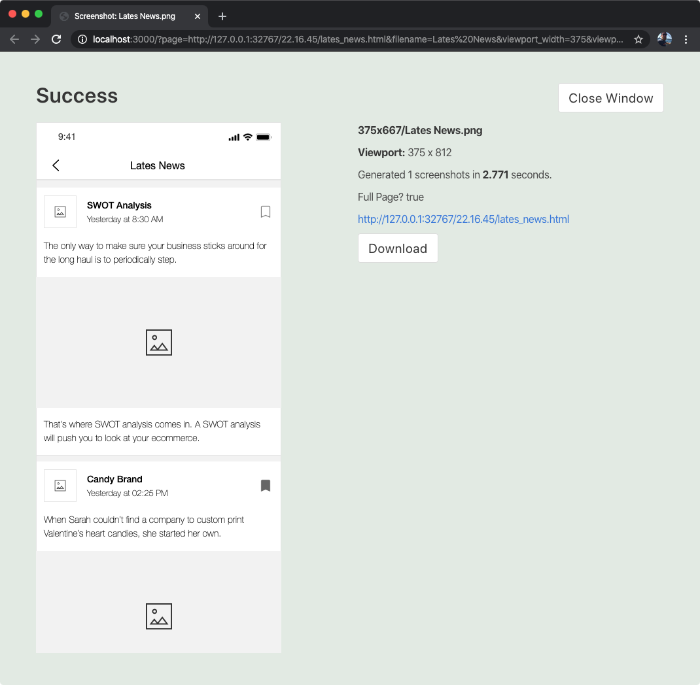

# Axure Screenshoot

Take quick single or multiple adaptive view screenshots with headless Chromium.
 **Note:** This is not a perfect solution. Sometimes you may want to capture screens manually or by using the Screen Capture plugin in chrome. I've found these methods take a while when doing many screenshots and are hard to keep consistent. 

## Getting Started

This folder contains both a chrome extension and node/express project. 
The chrome extension will add an overlay in the top right corner of Axshare Previews and link you to the node services pages to create the screenshot(s).

### Prerequisites

This was built to work with Axure RP8. I haven't tested it on Axure 9 yet.

You'll need Node.js and Node Package Manager (NPM) installed to run this service. NPM will install all the needed dependencies, including Chromium. This was built with node v10.16.0 and NPM v6.9.0.

This will require using Terminal commands.


### Installing

This will guide you through installing Node.js, Node Package Manager (NPM), and the chrome extension.


#### Getting this project locally. 
1. Click Clone Or Download, and select Download ZIP file and unzip where you want the project to live. (you can try to download from this link: [https://github.com/claytongray/axure-screenshoot/archive/master.zip](https://github.com/claytongray/axure-screenshoot/archive/master.zip))


#### Install Node, npm
1. Download and install node.js from their website: [https://nodejs.org/en/download/](https://nodejs.org/en/download/).
2. NPM comes with Node.js so you're ready to go with both of those. To check if it worked, open terminal and type `node -v`. That should return your Node.js version. `npm -v` should return the npm version.


#### Install node modules, including Puppeteer/Chromium
1. Open terminal. 
2. Open the screenshoot-service directory. So if the project folder is located on my deskop it would type:
	```
	cd /Users/clayton/Desktop/axure-screenshoot/screenshoot-service
	```
	Or, you can drag and drop the folder right into terminal. Type `cd ` into the terminal (with the space) and then drag the folder into the terminal window to get the folder's path. Remember to drag the "service" folder, not the top-level project folder or chrome extension folder.
3. Now enter `npm install` to automatically install all the dependencies needed for this project via npm. 
**REMEMBER:** You want to be inside the `screenshoot-service` folder before starting `npm -install`. If you are not, you will get an error asking why there is no package file. 

#### Install the chrome extension

1. Go to [chrome://extensions/](chrome://extensions/)
2. In the top right, turn on "Developer mode" by clicking the toggle switch.
3. Then click Load Unpacked and select the Chrome Extension folder (`screenshoot-chromext`) from the project folder.

The extension is now installed in chrome and the overlay will show up when viewing the local axshare preview.




## Taking Screenshots

Taking screenshots is easy as clicking the screensize you want. 

Open a Axure preview on your local as you normally would. (Clicking "Preview" in Axure for example).
If the chrome extension is loaded correctly, it will show in the top right of the screen with 4 purple buttons. 
375, 1024, 1440, and All. By clicking the first three you will get 1 screenshot at that adaptive view.
If you click All, you will generate 3 screenshots at all three of those sizes.

You'll see your browser load another localhost page. That kicks off the node process to start taking screen shots. Once you're done with the screenshots you can happily close that window. Do NOT refresh that page when you make an update. Axure often versions unique urls to keep your browser from caching pages, so once you use that link, you'll want to close it and start again from the Axshare preview page.

When that starts, it loads an invisible Chromium, opens the page, resizes to the adaptive view size, captures the screen, saves the file, and closes out. This happens multiple times for multiple screenshots and you won't even notice it.

Screenshots are saved in `/screenshoot-service/public/screenshots/`.
Each adaptive view is stored in their own folder. 
File names are generated based off of the "Page name" in Axure.


## Errors

#### After clicking a viewport size, my browser instantly says connection refused.
The node.js screenshot service probably isn't running. Make sure your terminal is open and the node service is running. 

#### After clicking a viewport size, my tries for a while and I see a nice error screen that says ERR CONN REFUSED
Axure isn't running. 

#### After clicking a viewport size, my tries for a while and I see a nice error screen that says ERR TIMEOUT30000
Axure took too long. Hit refresh on that page.

#### TO DO

  * Make the adaptive buttons based on the adaptive views in the left panel.